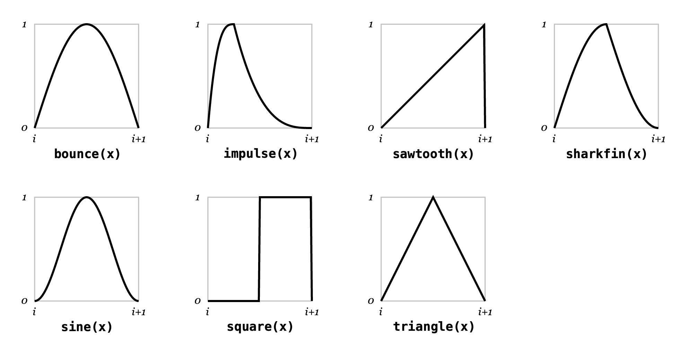

# Built-in Functions

**Flitter** supports the following built-in functions.

## Vector utility functions

`accumulate(` *xs* `)`
: Return a vector with the same length as *xs* formed by adding each value to an
accumulator starting at *0*.

`len(` *xs* `)`
: Return the length of vector *xs*.

`max(` *x* [ `,` ...] `)`
: Return the maximum value in the vector *x* with one argument, or the largest
of the arguments in vector sort order.

`maxindex(` *x* [ `,` ...] `)`
: Return the index of the maximum value in the vector *x* with one argument, or
the index of the largest argument in vector sort order (with the 1st argument
being index *0*).

`min(` *x* [ `,` ...] `)`
: Return the minimum value in the vector *x* with one argument, or the smallest
of the arguments in vector sort order.

`minindex(` *x* [ `,` ...] `)`
: Return the index of the minimum value in the vector *x* with one argument, or
the index of the smallest argument in vector sort order (with the 1st argument
being index *0*).

`shuffle(` *source* `,` *xs* `)`
: Return the shuffled elements of *xs* using the pseudo-random *source* (which
should be the result of calling `uniform(...)`).

`sum(` *xs* `)`
: Return a single numeric value obtained by summing each element of vector *xs*.

`zip(` *xs* `,` *ys* [ `,` ...] `)`
: Return a vector formed by interleaving values from each argument vector; for
*m* arguments the resulting vector will be *n * m* elements long, where *n* is
the length of the longest vector; short arguments will repeat, so
`zip(1;2;3;4, 0) == (1;0;2;0;3;0;4;0)`.

## Mathematical functions

`abs(` *x* `)`
: Return absolute value of *x* (ignoring sign).

`acos(` *x* `)`
: Return arc-cosine (in *turns* not radians) of *x*.

`angle(` *x* `,` *y* `)`
: Return the angle (in *turns*) of the cartesian vector *x,y*.

`asin(` *x* `)`
: Return the arc-sine (in *turns*) of *x*.

`ceil(` *x* `)`
: Return mathematical ceiling of *x*.

`cos(` *x* `)`
: Return cosine of *x* (with *x* expressed in *turns*).

`exp(` *x* `)`
: Return *e* raised to the power of *x*.

`floor(` *x* `)`
: Return mathematical floor of *x*.

`fract(` *x* `)`
: Return mathematical fractional part of *x* (equivalent to `x - floor(x)`).

`hypot(` *x* `,` [...] `)`
: Return the square root of the sum of the square of each value in `x` with one
argument, with multiple arguments return a vector formed by calculating the same
for the 1st, 2nd, etc., element of each of the argument vectors.

`log(` *x* `)`
: Return natural log of *x*.

`log2(` *x* `)`
: Return log 2 of *x*.

`log10(` *x* `)`
: Return log 10 of *x*.

`map(` *x* `,` *y* `,` *z* `)`
: Map a value of *x* in the range *[0,1]* into the range *[y,z]*; equivalent
to `y*x + (1-y)*z` (including in n-vector semantics).

`normalize(` *x* `)`
: Return `x / hypot(x)`.

`polar(` *th* `)`
: Equivalent to `zip(cos(th), sin(th))`.

`round(` *x* `)`
: Return *x* rounded to the nearest integer number, with *0.5* rounding up.

`sin(` *x* `)`
: Return sine of *x* (with *x* expressed in *turns*).

`sqrt(` *x* `)`
: Return the square root of *x*.

## Waveform functions

All of the waveform functions return a repeating wave in the *y* range [0,1]
with one wave per unit of *x*.

`bounce(` *x* `)`
: A wave akin to a bouncing ball made up of half of a sine wave.

`impulse(` *x* [ `,` *c=0.25* ] `)`
: A cubic rising and falling wave with the high point at *c*.

`sawtooth(` *x* `)`
: A rising sawtooth wave function.

`sharkfin(` *x* `)`
: A "shark fin" wave function made up of two quarter parts of a sine wave.

`sine(` *x* `)`
: A sine wave shifted so that it begins and ends at *0*.

`square(` *x* `)`
: A square wave with the rising edge at *0.5*.

`triangle(` *x* `)`
: A symmetric triangle wave function.



## Easing functions

The "easing" functions map from *x* in the range *[0, 1]* to a *y* in the range
*[0, 1]*, with values of *x* less than *0* returning *0* and values greater
than *1* returning *1*.

`linear(` *x* `)`
: A linear easing function.

`quad(` *x* `)`
: A quadratic easing function.

`snap(` *x* `)`
: A square-root easing function (conceptually a quadratic easing function with
the *x* and *y* axes flipped).


## Pseudo-random functions

`beta(` *seed* `)`
: A *Beta(2,2)* distribution pseudo-random source.

`normal(` *seed* `)`
: A *Normal(0,1)* distribution pseudo-random source.

`uniform(` *seed* `)`
: A *Uniform(0,1)* distribution pseudo-random source.

**Flitter** provides three useful sources of pseudo-randomness. These functions
return special "infinite" vectors that may only be indexed. These infinite
vectors provide a reproducible stream of pseudo-random numbers.

The single argument to all of the functions is a vector that acts as the
pseudo-random seed. Floating-point numbers within this seed vector are truncated
to whole numbers before the seed is calculated. This is deliberate to allow new
seeds to be generated at intervals, e.g.: `uniform(:foo;beat)` will create a new
stream of pseudo-random numbers for each beat of the main clock. Multiplying or
dividing this seed value then allows for different intervals, e.g., four times a
beat: `uniform(:foo;beat*4)`.

Similarly, the index value to the infinite-vector is truncated to pick a
specific number in the stream. For example:

```flitter
let SIZE=1280;720

!window size=SIZE
    !canvas
        for i in ..10
            let x=uniform(:x;i)[beat] y=uniform(:y;i)[beat]
                r=2*beta(:r;i)[beat] h=uniform(:h;i)[beat]
            !path
                !ellipse point=(x;y)*SIZE radius=r*50
                !fill color=hsv(h;1;1)
```

This will create 10 circles distributed uniformly around the window with
different radii clustered around 50 pixels and different uniformly picked hues.
Every beat, the circles will be drawn in different places and with different
sizes and hues. Note the use of symbols (`:x`, `:y`, etc.) combined with the
index of the circle to create unique seeds. This code will draw exactly the
same sequence of circles *every* time it is run as the pseudo-random functions
are stable on their seed argument. There is no mechanism for generating true
random numbers in **Flitter**.

The pseudo-random streams can be indexed with a range vector to generate a
vector of numbers, e.g.: `uniform(:some_seed)[..100]` will generate a 100-vector
of uniformly distributed numbers. The streams are arbitrarily long and are
unit-cost to call, so indexing the billionth number takes the same amount of
time as the 0th. Unlike normal vectors, the streams also extend into negative
indices (which actually wrap around to the end of the 64-bit unsigned integer
index range).

Pseudo-random streams may be bound to a name list in a `let` expression to
pick off the first few values, e.g.:

```flitter
let x;y;z = uniform(:position)
```

They are considered to be `true` in conditional expressions (`if`, `and`, etc.).
In all other aspects, pseudo-random streams behave like the `null` vector, e.g.,
attempts to use them in mathematical expressions will evaluate to `null`.

## Noise functions

`noise(` *seed* `,` *x* *[* `,` *y* *[* `,` *z* *] ] ]* `)`
: [OpenSimplex 2S](https://github.com/KdotJPG/OpenSimplex2) noise across 1 to 3
input dimensions.

- *seed* is a seed value, as per [Pseudo-random sources](#pseudo-random-sources)
- *x* is the first dimension
- *y* is an optional second dimension
- *z* is an optional third dimension

The function returns a value in the range *(-1,1)*. The function can be thought
of as creating a wiggly line in 1 dimension, a landscape with hills and dips in
2 dimensions or a volume of space filled with clouds in 3 dimensions.

A slice through 3D noise will look like the output of a 2D noise function and,
similarly, a slice through 2D noise will look like the output of a 1D noise
function. Often a useful thing to do is to use a value derived from the beat
counter as one of the inputs, yielding a 1D or 2D noise function that will
smoothly change over time for the same input space.

The function is entirely deterministic - always producing the same output
for the same inputs. The *seed* value should be used to create multiple
independent noise sources.

### Multi-value vector inputs

If one of the *x*, *y* or *z* arguments is a vector longer than 1, then the
function will return a multi-value output. The return value is equivalent to
the code:

```flitter
((noise(seed, ix, iy, iz) for iz in z) for iy in y) for ix in x
```

However, calling `noise()` with an *n*-vector will be significantly faster than
*n* separate calls.

### Multi-octave noise

It is often useful to layer a number of noise functions on top of each other
with different scales and weights to produce a more complex surface - this is
particularly useful when attempting to produce organic looking results.

For example:

```flitter
let n = 4
    scale = 1;2;4;8
    weight = 1;0.5;0.25;0.125
    total = sum(weight)
    z = (noise(:seed;i, x*scale[i], y*scale[i])*weight[i] for i in ..n) / total
```

Here the scale of the inputs doubles with each iteration and the weight halves.

**Flitter** provides a function that will do this calculation significantly
faster than the equivalent code:

`octnoise(` *seed* `,` *n* `,` *k* `,` *x* *[* `,` *y* *[* `,` *z* *] ] ]* `)`

where:

- *seed* is a seed value
- *n* is the number of octaves
- *k* is a weight constant
- *x* is the first dimension
- *y* is an optional second dimension
- *z* is an optional third dimension

For each octave iteration (from $0$ to $n-1$), the individual weight is computed
as $k^{-i}$ and the scaling factor for the inputs as $2^i$. A unique seed value
for each iteration is derived automatically from *seed*.

The equivalent `octnoise()` call to the code above would be:

```flitter
let z = octnoise(:seed, 4, 0.5, x, y)
```

Again, this function will accept *n*-vectors as inputs.

## Counters

`counter(` *counter_id* `,` *clock* [ `,` *rate* ] `)`
: Create/update/read a counter object.

Arbitrary counters can be managed with the `counter()` function. This takes
either two or three arguments and **has state side-effects**.

In the three-argument form the function will create or update a counter with a
specific `clock` value and `rate`, storing the current state of the counter in
the state mapping with the given `counter_id` key. The function returns the
current count.

Counters begin at zero and increment upwards by `rate` every unit increase of
`clock`. The counter rate can be changed at any point and the counter will
return the count at the previous rate before switching to counting with the
new rate. The stored state only changes when the rate changes. `clock`
*should* be a monotonically increasing number, such as `beat`. `rate` is
allowed to be zero to stop the counter or negative to count downwards.

Either `clock` or `rate` can be given as an n-vector to create a
multi-dimensional counter. This can be useful, for instance, to move an object
through space with a velocity vector:

```flitter
let velocity = 0.2;-1.5;3.0
    position = counter(:thing_position, beat, velocity)
```

The two argument form of the function omits the rate and returns the count
matching the value of `clock` at the last counter rate. If the counter has not
already been initialised, then the rate will default to 1.

## Color functions

`colortemp(` *t* `)`
: Return a 3-vector of *R*, *G* and *B* **linear sRGB** values for an
approximation of the irradiance of a Planckian (blackbody) radiator at
temperature *t*, scaled so that `colortemp(6503.5)` (the sRGB whitepoint
correlated colour temperature) is close to `1;1;1`; the approximation only holds
within the range *[1667,25000]* and, strictly speaking, values below 1900°K are
outside the sRGB gamut; irradiance is proportional to the 4th power of the
temperature, so the values are very small at low temperatures and become
*significantly* larger at higher temperatures.

`hsl(` *h* `;` *s* `;` *l* `)`
: Return a 3-vector of *R*, *G* and *B* in the range *[0,1]* from a 3-vector of
hue, saturation and lightness (also in the range *[0,1]*).

`hsv(` *h* `;` *s* `;` *v* `)`
: Return a 3-vector of *R*, *G* and *B* in the range *[0,1]* from a 3-vector of
hue, saturation and value (also in the range *[0,1]*).

## Text functions

`chr(` *o* `)`
: Return the unicode character identified by the ordinal number *o*.

`ord(` *c* `)`
: Return the ordinal number of unicode character *c* (as a string).

`split(` *text* `)`
: Return a vector formed by splitting the string *text* at newlines (not
included).

## File functions

`csv(` *filename* `,` *row* `)`
: Return a vector of values obtained by reading a
specific *row* (indexed from *0*) from the CSV file with the given *filename*;
this function intelligently caches and will convert numeric-looking columns in
the row into numeric values.

`read(` *filename* `)`
: Returns a single string value containing the entire text of *filename* (this
function intelligently caches).
