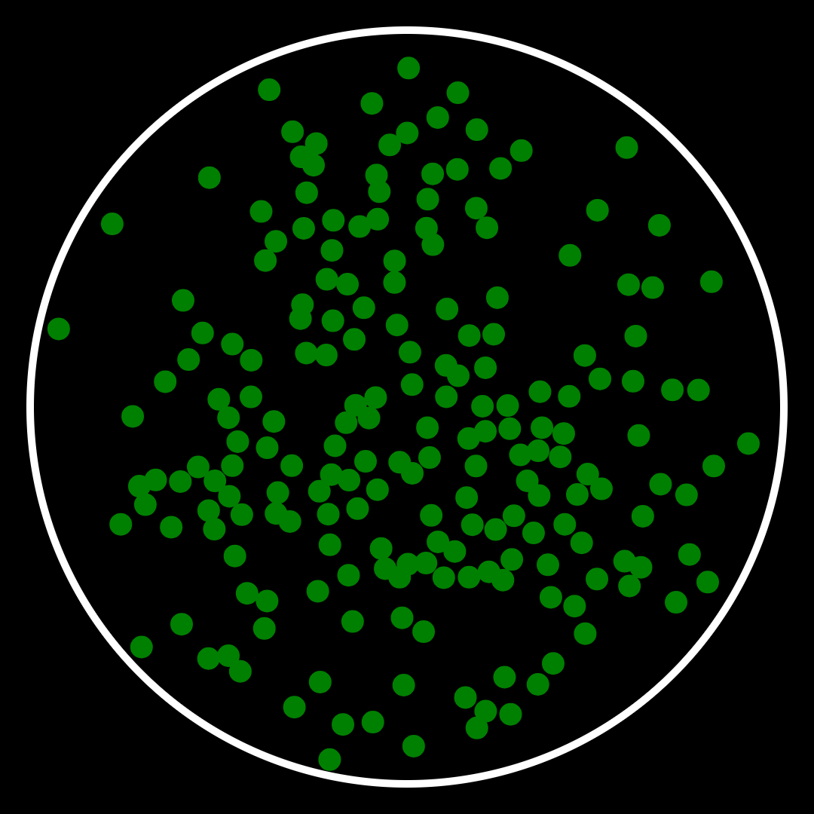

# Physics Simulation

**Flitter** supports a simple system for running physics simulations of particle
systems. The physics engine is configured with a set of nodes and will store the
current position and velocity of each particle in the state dictionary, allowing
it to be linked back to rendering code and nodes.

A new physics system is introduced by a `!physics` node at the top level,
containing a number of `!particle` or `!anchor` nodes along with force applier
nodes that define the specific physics of the system.

The physics engine is designed – as far as possible – to operate consistently
across any number of dimensions. For instance, the `!buoyancy` force is
proportional to the displaced mass, which will be calculated as a density
coefficient multiplied by the *area* in two dimensions and the *volume* in
three. When calculating such values, the standard constant terms (e.g.,
$\pi$ for area and ${4 \over 3} \pi$ for volume) are *not* included in the
calculations, on the basis that these can be easily incorporated into force
coefficients for physically-correct operation. The actual equations used for
each force are given below.

Systems with higher than three dimensions are possible, but their use may be
limited to theoreticians. On the other hand, one-dimensional systems are
genuinely useful for simulating objects constrained to move in a single
dimension - like beads on a wire - where collisions, drag, springs and
rubber bands are all well defined forces.

## Nodes

### `!physics`

A `!physics` node at the top level in a **Flitter** script creates a new
simulation system. The attributes are:

- `state` is a required attribute giving a state prefix key; all of the state
of the system will be stored in the **Flitter** state dictionary with keys
prefixed by this
- `dimensions` is a required attribute giving the number of dimensions of the
system, i.e., the length of the position, value and force vectors (must be
greater than or equal to `1`)
- `time` is an optional attribute providing the simulation clock
- `resolution` is an optional attribute specifying a *minimum* simulation step
interval
- `run` specifies an optional integer "run number" for this simulation,
non-integer values will be *floor*ed
- `speed_of_light` is an optional attribute that, if set, specifies an upper
limit to any particle's computed speed

If `time` and `resolution` are not specified then the system will default to
**Flitter**'s internal frame time (i.e., the value of the `time` global) and
the target frame-rate interval (i.e., `1/fps`) respectively. This means that
the simulation time units will be seconds and the simulation will advance in
time steps equal to the frame interval. If `time` *is* specified then
`resolution` should be set to a sensible matching value somewhere at or above
the expected increment in `time` at the engine frame-rate.

If `run` changes then the current system state is abandoned and the simulation
will begin again from the starting positions and velocities of each particle.
As this value is *floor*ed before being used, a simulation can be easily reset
at intervals by setting `run=time/interval`.

All other nodes described below must be contained within a `!physics` node.

:::{note}
Starting a simulation with forces immediately applied can cause wild instability
due to massive forces being computed. This applies particularly when using a
collision force applier and particle starting positions that may overlap. To
avoid this, all forces can be "eased"-in with the `ease` attribute. This
specifies an amount of simulation time to linearly ramp up the strength of the
force applier, giving an amount of time for particles to settle into more stable
positions.
:::

#### The Simulation Clock

The simulation maintains an internal simulation clock that begins at zero and
advances in simulation steps. On each frame, a delta is calculated between
the current value of time minus the value at the last frame. The simulation
step will be the minimum of this delta and `resolution`.

If each delta is smaller than `resolution`, the internal clock will advance in
lockstep with `time`. If not, then the simulation will advance at `resolution`
intervals instead. This allows `resolution` to be used to avoid numerical
instability being caused by computing forces with large time deltas.

If the delta is greater than `resolution`, then the physics engine *may* insert
an additional simulation step if the general performance of the engine is good.
This allows the simulation to keep up if an occasional frame is delayed.

If the engine is consistently unable to keep up with the requested `resolution`,
then the internal simulation clock will advance more slowly than `time` and the
simulation will subjectively slow down (although all of the particles will
actually be moving correctly with respect to the simulation clock). It is best
to reduce program/simulation complexity if this is the case (or increase
`resolution` if the simulation will remain stable run at a lower granularity).

If **Flitter** is run in non-realtime mode, with the [`--lockstep` command-line
option](install.md#running-flitter), then the simulation behaviour is different.
In non-realtime mode, the simulation will *always* insert *as many* additional
simulation steps per frame as necessary to keep to the minimum resolution.

For example, if `resolution` is set to `1/60` and the engine is run with
`--lockstep --fps=30` – for instance, to record an output video – then the
simulation will advance *two* steps at each frame instead of subjectively
slowing down.

The internal simulation clock can be read from the state and used to track the
actual amount of simulation time that has passed (see [State
interaction](#state-interaction) below).

### `!particle`

A `!particle` node specifies a point/spherical object to be simulated. At each
step, the physics engine will compute the forces to be applied to each particle
based on their properties, current positions and velocities. These forces will
then be applied to the current velocity to generate a new velocity and the
position updated based on this.

```{math}
\vec{v}_{t+\Delta t} = \vec{v}_t +
\left( \sum_{i=0}^n \vec{F}_i \right) {\Delta t \over M}
```

```{math}
\vec{p}_{t+\Delta t} = \vec{p}_t + \vec{v}_{t+\Delta t} \cdot \Delta t
```

The attributes that specify properties of the particle are:

- `id` - each particle must have a unique `id` attribute and this will be
combined with the `!physics`' `state_prefix` value to produce keys against
which the current state of the particle will be stored in the state dictionary
- `position` - specifies an initial position vector to use for the particle at
the first simulation step (defaults to zero)
- `velocity` - specifies an initial velocity vector (defaults to zero)
- `force` - specifies a constant force vector to be applied to the particle,
this may be changed at any point during the simulation to create custom forces,
e.g., thrust from an engine (defaults to zero)
- `ease` - specifies an amount of simulation time over which to ramp up the
force vector (does nothing if `force` is not specified)
- `radius` - specifies a radius for a spherical particle, this is used both
in collision detection and when calculating drag force (defaults to 1 and will
be clamped to zero if negative)
- `mass` - specifies a value to be used both as the inertial component of
converting forces into acceleration and as the mass for computing gravitic
attraction (defaults to 1 and will be clamped to zero if negative)
- `charge` - specifies a value to be used for calculating electrostatic force
(defaults to 1)

As `mass` is used when calculating acceleration, particles with zero mass
cannot be the subject of a force, meaning they will always continue travelling
at their initial velocity (or remain fixed at their initial position).
However, particles with zero mass will still be considered when computing
forces on other particles.

### `!anchor`

An `!anchor` is a particle that is considered for the purposes of calculating
forces, but will not be affected by any force – including a `force`
attribute. The attributes are otherwise the same as for `!particle`, with the
added difference that `position` specifies the *current* position of the object
rather than an initial value, so an `!anchor` may be arbitrarily moved around.

While a zero-mass particle is similar to an anchor, a zero-mass particle cannot
be moved once the simulation has started. An anchor can usefully have zero mass,
for example if it is to be one side of a distance force but should be ignored
for the purposes of calculating attraction due to gravity.

### `!barrier`

A `!barrier` constrains all particles to be on one side of it. In the case of
a system with 3 dimensions, this will be an infinite plane; with 2 dimensions,
a line; and with 1 dimension, a point. Particles that hit a barrier will
"bounce" by reflecting their velocity using the normal of the barrier.

- `position` - specifies the origin for the barrier
- `normal` - specifies the orientation of the barrier; particles are
constrained to be on the side of the barrier in the direction of this vector
- `restitution` - the coefficient of restitution (default is `1`)

Particles bouncing off a barrier will have reflected speed equal to the speed
at which they hit the barrier multiplied by the coefficient of restitution: a
value of `1` will result in a perfectly elastic collision, whereas `0` would
mean all of the particle's velocity is absorbed.

### `!constant`

Specifies a constant force or acceleration to be applied to all particles. This
is useful for simulating global forces, such as large-body gravity.

- `force` - specifies a constant force vector
- `acceleration` - specifies a constant acceleration vector
- `strength` - specifies a multiplier for `force`/`acceleration` vector
(default is `1`)
- `ease` - specifies an amount of simulation time over which to ramp up
`strength`

Both `force` and `acceleration` may be specified and will apply separately. If
`acceleration` is specified then it is converted into an equivalent force by
multiplying by the particle `mass`.

### `!random`

Specifies a random, "Brownian motion", force to be applied to all particles.
This consists of a normal variate, per-particle, force that varies on each
simulation step.

- `strength` - force magnitude coefficient (default is `1`)
- `ease` - specifies an amount of simulation time over which to ramp up
`strength`

### `!field`

`!field` creates a uniformly oriented force that will apply to all particles
in proportion to their `charge` attribute. Positively-charged particles will be
accelerated in the direction of the field and negatively-charged particles will
be accelerated in the opposite direction to the field.

- `direction` - a vector specifying the direction of the electric field
- `strength` - force magnitude coefficient
- `ease` - specifies an amount of simulation time over which to ramp up
`strength`

`direction` does not need to be a unit vector – and will not be normalized. Any
magnitude of the vector will be combined with `strength` to specify the field
strength.

```{math}
\vec{F} = \textbf{strength} \cdot \vec{\textbf{direction}} \cdot \textbf{charge}
```

### `!distance`

Specifies a force to be applied between two specific particles that scales with
displacement from a minimum or maximum distance. This can be used to simulate
various tethers, rubber bands and springs.

- `from` - the `id` of the first particle
- `to` - the `id` of the second particle
- `min` - a minimum distance that the two objects can be apart
- `max` - a maximum distance that the two objects can be apart
- `fixed` - a shortcut for setting both `min` and `max` to the same value
- `power` - the power to which the displacement will be raised (default is `1`)
- `strength` - force magnitude coefficient
- `ease` - specifies an amount of simulation time over which to ramp up
`strength`

```{math}
l = \left| \vec{p}_\textbf{to} - \vec{p}_\textbf{from} \right|
```

```{math}
\vec{d} = {\vec{p}_\textbf{to} - \vec{p}_\textbf{from} \over l}
```

```{math}
\vec{F} = \begin{cases}
\textbf{strength} \cdot (l - \textbf{min})^\textbf{power} \cdot \vec{d}
& \text{if $l < \textbf{min}$} \\
\textbf{strength} \cdot (l - \textbf{max})^\textbf{power} \cdot \vec{d}
& \text{if $l > \textbf{max}$}
\end{cases}
```

```{math}
\vec{F}_\textbf{from} = \vec{F}
```

```{math}
\vec{F}_\textbf{to} = -\vec{F}
```

### `!collision`

This creates an implicit `!distance` force applier between all pairs of
particles, with `min` set to the sum of the `radius` attributes of each
particle. Particles with zero `radius` will be ignored.

- `power` - the power to which the displacement will be raised (default is `1`)
- `strength` - force magnitude coefficient
- `ease` - specifies an amount of simulation time over which to ramp up
`strength`

The `strength` attribute is inversely proportional to the elasticity of the
particles: lower values mean the particles can overlap more before bouncing
apart. Setting this value too high can cause wild instability – especially if
random starting positions are chosen that might cause particles to
overlap each other.

### `!gravity`

`!gravity` creates an attractive force that applies to all pairs of particles
in proportion to the product of their `mass` attributes and inversely
proportional to the square of the distance between the particles. Particles
with zero `mass` will be ignored.

- `strength` - force magnitude coefficient
- `ease` - specifies an amount of simulation time over which to ramp up
`strength`
- `max_distance` - pairs of particles further apart than this will be ignored

```{math}
\vec{F} = \textbf{strength} \cdot \vec{d} \cdot
{ \textbf{mass}_{from} \cdot \textbf{mass}_{to} \over l^2}
```

```{math}
\vec{F}_{from} = \vec{F}
```

```{math}
\vec{F}_{to} = -\vec{F}
```

As gravity falls off with the square of the distance, `strength` will normally
need to be quite a large number to see any noticeable effect. `max_distance` is
an optimization feature that allows running the simulation slightly faster by
skipping over particle pairings where they are far apart and will have only a
minimal effect on each other.

The distance value $l$ is constrained to be no smaller than the sum of the two
particles' radii, i.e., overlapping particles experience a *constant* attractive
force. This is to avoid wild instability caused by two particles being crushed
together.

### `!electrostatic`

`!electrostatic` creates a repulsive force that applies to all pairs of
particles in proportion to the product of their `charge` attributes and
inversely proportional to the square of the distance between the particles.
Particles with zero `charge` will be ignored. Particles with the same sign
charge will repel each other and particles with oppositely signed charges will
attract each other.

- `strength` - force magnitude coefficient
- `ease` - specifies an amount of simulation time over which to ramp up
`strength`
- `max_distance` - pairs of particles further apart than this will be ignored

```{math}
\vec{F} = \textbf{strength} \cdot \vec{d} \cdot
{\textbf{charge}_{from} \cdot \textbf{charge}_{to} \over l^2}
```

```{math}
\vec{F}_{from} = -\vec{F}
```

```{math}
\vec{F}_{to} = \vec{F}
```

Except for being reversed and the ability to have negative charges,
electrostatic force operates in the same way as gravity – including the rule
for overlapping particles.

### `!adhesion`

`!adhesion` creates an attractive/repulsive force that applies to all pairs of
particles that overlap. It is proportional to the amount of the overlap times
the particle pair distance minus an "adhesion distance". The result is that two
particles that touch will draw towards each other until they reach the adhesion
distance and then will begin to repel each other.

The adhesion distance is determined by the `overlap` attribute which should be
between `0` and `1`. At `0`, no overlap is tolerated (resulting in the
equivalent of a `!collision` force with `power=2`) and at `1`, the smaller
particle will be drawn completely within the larger.

- `overlap` - a factor controlling the amount of overlap (default is `0.25`)
- `strength` - force magnitude coefficient
- `ease` - specifies an amount of simulation time over which to ramp up
`strength`

```{math}
l_{max} = \textbf{radius}_{from} + \textbf{radius}_{to}
```

```{math}
l_{min} = | \textbf{radius}_{from} - \textbf{radius}_{to} |
```

```{math}
l_{adhesion} = l_{min} \cdot \textbf{overlap} + l_{max} \cdot ( 1 - \textbf{overlap} )
```

```{math}
l_{overlap} = max( 0, l_{max} - l )
```

```{math}
\vec{F} = \textbf{strength} \cdot \vec{d} \cdot l_{overlap}^2 \cdot (l - l_{adhesion})
```

```{math}
\vec{F}_{from} = \vec{F}
```

```{math}
\vec{F}_{to} = -\vec{F}
```

As adhesion contains a repulsive force, it is not normally necessary to use it
together with `!collision`.

:::{note}
The `!collision`, `!gravity`, `!electrostatic` and `!adhesion` force appliers
are all compute-intensive as they have to consider all particle *pairs* and
so have $O(n^2)$ time-complexity.
:::

### `!drag`

`!drag` simulates the effect of particles moving through a liquid/gas by
applying a force to each particle, against the direction of movement, in
proportion to the square of the speed and the particle cross-sectional size
(the radius raised to the power of $\textbf{dimensions} - 1$). This is
very useful for taking energy out of a simulation, otherwise particles will
tend to bounce around forever. Particles with zero `radius` will be ignored.

- `flow` - specifies the velocity of the medium (default is `0`)
- `strength` - force magnitude coefficient
- `ease` - specifies an amount of simulation time over which to ramp up
`strength`

```{math}
\vec{v'}_t = \vec{v}_t - \vec{\textbf{flow}}
```

```{math}
{speed} = |\vec{v'}_t|
```

```{math}
\vec{d} = { \vec{v'}_t \over {speed} }
```

```{math}
\vec{F} = \textbf{strength} \cdot (-\vec{d}) \cdot {speed}^2 \cdot
\textbf{radius}^{\textbf{dimensions} - 1}
```

The `flow` attribute allows simulation of a moving medium, such as a river or
a breeze. If `flow` is a non-zero vector then the `!drag` force will accelerate
particles until they are motionless with respect to the medium.

As drag scales with the square of the speed and the particle cross-sectional
area, the `strength` coefficient should normally be a *very* small number. This
force applier is limited to ensure that simulation granularity issues cannot
cause a particle to reverse direction (with respect to the medium).

### `!buoyancy`

`!buoyancy` simulates the effect of particles rising or falling within a fluid
based on their relative density to that fluid and the effects of gravity. The
force is equal to the mass of the particle minus the displaced mass of the
surrounding fluid (i.e., the volume of the particle multiplied by the density
of the fluid) multiplied by the gravity vector.

- `gravity` - vector specifying the direction and magnitude of gravity (default
is a vector with the last dimension equal to `-1`)
- `density` - the density coefficient of the surrounding fluid (default is `1`)
- `strength` - force magnitude coefficient
- `ease` - specifies an amount of simulation time over which to ramp up
`strength`

Particles with either zero radius or zero mass will be ignored.

```{math}
m = \textbf{density} \cdot \textbf{radius}^\textbf{dimensions}
```

```{math}
\vec{F} = \textbf{strength} \cdot  \vec{gravity} \cdot  ( \textbf{mass} - m )
```

## Groups

A `!physics` system may contain one or more nested `!group` nodes. Each begins
a new semi-isolated group of particles and forces. The `!physics` node counts
as the outermost group. Particle (and anchor) `id`s must be unique across the
entire system.

Forces are applied to particles according to the following rules:

`!distance`
: As distance forces reference a specific pair of particles (or a particle and
an anchor), they are applied to the referenced particles regardless of which
group they or the particles are declared in.

`!constant`, `!random`, `!field`, `!drag`, `!buoyancy`
: These forces apply to particles within the group in which the force is
declared and to particles in all sub-groups within that group. Declaring any of
these at the top level of the `!physics` system applies them to all particles.

`!barrier`
: Barriers apply to particles within the group in which they are declared,
and to particles in all sub-groups below that group.

`!collision`, `!electrostatic`, `!gravity`, `!adhesion`
: These pair-wise forces apply to pairs of particles within the group in which
the force is declared, within sub-groups of that group, and pairs of particles
between sub-groups and all of their parent groups leading up to the group in
which the force was declared. These forces do not, however, apply between
sibling sub-groups.

As the latter forces apply to all pairs of particles, they are the most
expensive to compute. Therefore, limiting them to not apply across sub-groups
allows for fine-grained control over which pairs the forces should apply.

## State interaction

For a `!physics` system with `state` set to *prefix*, and a particle with `id`
set to *id*, the following key/value pairs will be stored in the state
dictionary:

- *prefix* - the value of `time` when the simulation (or run) started
- *prefix*`;:last` - the last value of `time`
- *prefix*`;:clock` - the (zero-based) internal simulation clock
- *prefix*`;:run` - the last run number (as an integer value)
- *prefix*`;:iteration` - the number of the last simulation iteration for this
run (an integer counting from `0`)
- *prefix*`;`*id* - the last position of the particle
- *prefix*`;`*id*`;:velocity` - the last velocity of the particle

`!anchor` particles still store their position and velocity in the state
dictionary, even though position will always be whatever was provided with the
`position` attribute and velocity will always be a zero vector.

`state` and `id` can be any non-null vectors, but `id` must be unique within
the system and `state` must be unique if multiple simultaneous systems are
used. Obviously one should avoid using a `state` prefix that might collide with
other users of the state dictionary, such as MIDI controllers. One should also
not use `:last`, `:clock` or `:run` as the `id` of a particle.

Performance of the state system is negatively affected by using `id` values
that contain strings - stick to symbols when possible.

## Example



This example creates a "petri dish" of cell particles with normally-distributed
random charges. An `!electrostatic` force applier makes the cells drift together
or apart, clumping up into different shapes. Chains of cells with alternating
charge will form and break up.

A `!collision` force applier stops them from overlapping with each other and a
`!distance` force applier is used to constrain the particles within the dish
by setting a maximum distance for each from an anchor in the middle. A `!drag`
force applier slows the particles as if they are moving through a liquid.
Without any external forces, the drag will cause this system to come to a static
equilibrium, so a `!random` force is applied to each particle.

The `beat` clock is used as the simulation time, allowing the simulation to be
sped up or slowed down by altering the tempo. `resolution` is calculated to
match the current tempo to the target frame-rate.

```{literalinclude} diagrams/petri.fl
   :language: flitter
   :lines: 1-30
   :emphasize-lines: 8-18
```

Note that the `strength` coefficients for the `!electrostatic` and `!collision`
force appliers are "eased in" by increasing them linearly over the first 10
beats. This allows any particles with overlapping start positions to gently
move apart at the beginning.
