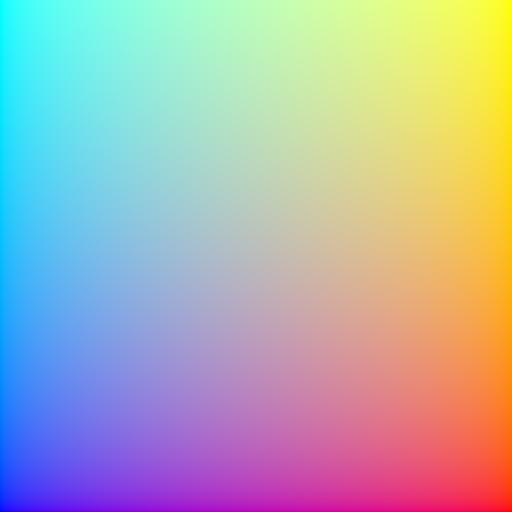

# Shaders

**Flitter** supports running arbitrary "screen space" OpenGL shader programs
as stacked image generators and filters.

This is similar to the operation of shader explorers such as
[ShaderToy](https://shadertoy.com/), but fully integrated into the **Flitter**
window hierarchy. This means **Flitter** shaders can manipulate the output
of other render nodes and be used as images or patterns in [2D
drawing](canvas.md), or as model textures in [3D rendering](canvas3d.md). For
instance, one might take a running [`!video`](windows.md#video), manipulate it
with a shader and then map the output onto the surface of a spinning sphere
in a [`!canvas3d`](canvas3d.md).

## `!shader`

The `!shader` node allows insertion of an arbitrary OpenGL shader program into
the [window render tree](windows.md). `!shader` nodes support the following
attributes:

`size=` *WIDTH*`;`*HEIGHT*
: The output image size of this shader.

`colorbits=` [ `8` | `16` | `32` ]
: This overrides the color channel bit depth for this node's output image
(and any intermediate textures).

`vertex=` *STRING*
: Specifies the vertex shader program as a text string containing the GLSL code.
Usually this would be read from a file with the [`read()` built-in
function](builtins.md#file-functions). If unspecified, a standard internal
shader will be used.

`fragment=` *STRING*
: Specifies the fragment shader program as a text string containing the GLSL
code. Usually this would be read from a file with the [`read()` built-in
function](builtins.md#file-functions). If unspecified, the default simple
compositing shader program will be used (which is fine if compositing is all
you want to do).

Shader programs can access the image output of all child nodes declared
within the `!shader` node. The behaviour of these samplers for coordinates
outside the $[0,1]$ range can be controlled with either the attribute:

`border=` *R*`;`*G*`;`*B*`;`*A*
: Specifies a color that will be returned for any out-of-range coordinates.

or with the attribute:

`repeat=` *RX*`;`*RY*
: Specifies whether to wrap around (and therefore repeat) the image on the
X and Y axes, if *RX* or *RY* is `true`, or to return the color at the edge of
the image, if *RY* or *RX* is `false`.

If neither `border` nor `repeat` is specified, then the default is for
out-of-range samples to return transparent (`vec4(0.0)`).

By default linear interpolation is used when sampling a child with a different
size to the shader (for both minification and magnification). This can be
turned off with the attribute:

`nearest=` *BOOLEAN*
: Specify `nearest=true` to use nearest pixel sampling instead of linear
interpolation.

### Shader programs

Shader programs are executed with the following assumptions:

- The $[-1,1]$ screen-space vertices of a tri-strip covering the whole output
frame-buffer is passed to the vertex shader as an `in vec2 position` varying
- The default vertex shader passes standardized $[0,1]$ UV coordinates to the
fragment shader via an `out vec2 coord` varying
- The fragment shader is expected to declare an `out vec4 color` varying that
will be written to the node's output image

It is not usually necessary to specify a vertex shader program (with the
`vertex` attribute), as the default program is sufficient for most custom
shaders.

A minimum fragment shader would therefore look something like:

```{literalinclude} diagrams/dummyshader.frag
   :language: glsl
```

If saved as the local file `dummyshader.frag`, this could be used in a
**Flitter** program:

```flitter
!window
    !shader fragment=read('dummyshader.frag')
```

This simple example results in the output:



### Standard uniforms

The vertex and fragment shaders have a number of available uniforms that
will be automatically set if declared:

`uniform vec2 size`
: Will be set to the the pixel-size of the node's output frame-buffer, the
`coord` UV coordinates can be multiplied by this to get actual pixel
coordinates in the fragment shader.

`uniform float beat`
: The current beat counter.

`uniform float quantum`
: The current quantum.

`uniform float tempo`
: The current tempo.

`uniform float delta`
: The difference between the current beat counter and the its value on the last
frame.

`uniform float time`
: The current frame time in seconds.

`uniform int fps`
: The target frame-rate.

`uniform float performance`
: A value in the range $[0.5,2]$ that indicates how well the engine is managing
to hit the target frame-rate.

`uniform float alpha`
: The value of the `alpha` attribute on the node or a default value of `1`.
This is *not* automatically applied to the output of custom shaders and must be
applied in the code if desired.

`uniform sampler2D` [ `texture0` | `texture1` | … ]
: These will be bound to the output image of each child node, in order of
definition (and excluding any node that has a `hidden=true` attribute).

`uniform sampler2D last`
: If declared, this sampler allows access to the final output of the shader
from the previous frame. This allows for feedback loops to be constructed.

In addition to these, the shader program may declare arbitrary numeric uniforms
that can be set using attributes with matching names on the shader node.
`float`, `vec2`, `vec3`, `vec4`, `mat3` and `mat4` uniforms expect 1-, 2- , 3-,
4-, 9- and 16-item numeric vectors, respectively; arrays of these types expect
vectors with an appropriate multiple of these sizes. `int`s, `double`s and
`bool`s, plus their `vec` and `mat` variants are also supported. If an
attribute matching the uniform is not provided (or is of an incorrect type)
then all elements of the uniform will be set to $0$.

### Multi-pass shaders

A shader program can be executed multiple times per-frame, with the output
image of each pass provided as an input to the next. This is controlled with
the following attributes:

`passes=` *PASSES*
: This specifies how many times the program should be executed. Default is `1`
if not specified.

`downsample_passes=` *PASS_NUMBERS*
: This specifies which (if any) passes to render with a smaller frame-buffer.
It is specified as a vector of pass numbers, with the first pass being `0`.
For example `1;2` would specify the second and third pass. Default is `null`,
i.e., all passes will be rendered with a `size` frame-buffer.

`downsample=` *DIVISOR*
: This specifies how much to reduce the size of the output frame-buffer for
down-sampled passes. It is specified as a divisor of the shader `size`
attribute. Default is `2`, i.e., the frame-buffer will be half the width and
height, and therefore contain a quarter of the pixels. The value of the `size`
uniform (if declared) will be the current pass' output frame-buffer size.

For multi-pass shaders, the `last` sampler uniform provides access to the output
image of the previous frame *only* during the first pass (`pass` is $0$). For
subsequent passes, this sampler will access the output of the previous pass.

The following additional uniforms are available:

`uniform int passes`
: Will be set to the number of times that this shader will be executed, as
specified by the `passes` attribute.

`uniform int pass`
: Will be set to the number of the current pass, counting from `0`.

`uniform int downsample`
: Will be set to the value of `downsample` for down-sampled passes and `1` for
normal passes.

`uniform sampler2D first`
: If declared, this sampler allows access to the output of the *first pass* of
the shader in the second and subsequent passes. During the first pass, `first`
will be a "zero" texture returning transparent for any coordinate.

The `first` sampler is specifically designed to allow an initial pass to build
up an output that will be used in the final pass of a shader *in addition* to
the output of a subsequent pass (with `last`). For filters like the built-in
[`!bloom` filter](#bloom), this initial pass is used to composite together
all of the child nodes before blurring. The final pass is then able to refer to
both the composited original and the blurred version.

All passes have access to the standard uniforms, including the samplers for all
child nodes.

## Shader templating

**Flitter** uses [Mako templates](https://www.makotemplates.org) internally to
allow shaders to adapt to different uses. Shader code will be evaluated using
this before being compiled. All of the uniform names described above (except
`pass`), and any custom attributes on the `!shader` node, are available as
values to the template logic.

In addition, the following special names are defined:

`HEADER`
: Will be set to either the standard OpenGL 3.3 version header or an OpenGL ES
3.0 version header, depending on whether the engine is runnning in ES mode or
not. Shader code that is compatible with both of these versions (which includes
all of the internal **Flitter** GLSL code) can use `${HEADER}` as the first
line to automatically adapt.

`child_textures`
: Will be set to a list of strings representing the uniform name for each of
the sub-nodes of this shader, e.g., `texture0`. If the shader has no children
then this list will be empty. A shader can use template `<% for %/>` loops to
declare the correct number of sampler uniforms and handle a variable number of
child nodes.

Note that if a shader is templated on a value, then it will be automatically
recompiled if that value changes (or, to be precise, if the changed value
causes a change in the evaluated source text). This will cause severe rendering
performance problems if if occurs frequently. So one should avoid using a
dynamically-changing value in the templating logic.

For instance, one might use these attribute values:

```flitter
!shader fragment=read('myshader.frag') count=3 offset=-3;4.5
```

in a shader program as compile-time constants:

```mako
const int count = ${int(count)};
const vec2 offset = vec2(${float(offset[0])}, ${float(offset[1])});
```

:::{note}
The current value of `pass` is *not* provided to the template engine – the same
shader program is used for each pass of a multi-pass shader. Multi-pass shader
programs should use the `pass` uniform and switch behaviour in code for
different passes.
:::

## Built-in image filters and generators

**Flitter** provides a set of useful built-in filters and generators, each of
which is implemented as a shader program. Each of these nodes, in common
with the default [`!shader` program](#shader), accepts one or more child nodes
which will be composited together with the blend function controlled with
the `composite` attribute (default `:over`). All of the filters also support
the standard shader `alpha` attribute.

### `!transform`

Composites its input nodes and then scales, rotates and translates its output.
This is similar to the `!translate` node in `!canvas` and `!canvas3d`. The
origin for all of these operations is the *centre* of the image.

`scale=` *SX*`;`*SY*
: Specifies an amount to scale the image on the X and Y axes, default `1`.
Negative scales will flip the image on the X and/or Y axis.

`rotate=` *TURNS*
: Specifies a clockwise rotation in *turns*, default `0`.

`translate=` *X*`;`*Y*
: Specifies an amount to translate the image on the X and Y axes specified in
*pixels*, with the Y axis pointing up, default `0`.

`keystone=` *KX*`;`*KY*
: Specifies a "keystone" adjustment to the image, as a scaling factor along the
$x$ and $y$ axes. A positive (small) value of *KX* will expand the left side of
the image and compress the right side; a negative value will do the reverse.
Similarly, a positive value of *KY* will expand the bottom of the image and
compress the top; a negative value will do the reverse. Together these can be
used to adjust for projection onto a tilted surface. They will normally have to
be used with `scale=` to avoid clipping of the image.

Areas "outside" the transformed image will be transparent by default. This can
be controlled with the `border` and `repeat` attributes described above for
[`!shader`](#shader).

The order that the attributes are specified is important. Transforms are
applied from the rightmost attribute (last) to the leftmost (first).

### `!vignette`

A *very* simple vignette filter that composites its input nodes and then fades
the edges of the output to transparent. It is controlled with the attributes:

`inset=` *(0,0.5)*
: Specifies the inset as a proportion of the height and width at which the
fade-out will occur, default `0.25`.

`fade=` [ `:linear` | `:quad` | `:cubic` ]
: Specifies the function to use for the fade at the edges. Default is `:linear`.

### `!adjust`

The `!adjust` node applies color and luminance adjustments to the composited
input. It supports the following attributes:

`color_matrix=` *MATRIX*
: Specifies a 3x3 matrix as a 9-vector to multiply each pixel by. The matrix
is given in column-major order, so the first 3 values are multiplied by the red
channel, the second 3 by the green channel and the last 3 values by the blue
channel. The resulting color will be the vector sum of the results. Default is
the matrix `1;0;0;0;1;0;0;0;1`, i.e., no adjustment.

`brightness=` *LEVEL*
: Specifies a brightness adjustment to be added to the color channels of each
pixel. Default is `0`.

`contrast=` *MULTIPLIER*
: Specifies a contrast adjustment as a multiplier. This defaults to `1`. A
contrast adjustment above 1 multiplies the value of each pixel around the
midpoint, i.e., channels above 0.5 will become brighter and channels below 0.5
will become darker. A contrast adjustment below 1 will compress the dynamic
range around 0.5.

`exposure=` *STOPS*
: Specifies an exposure adjustment in stops. An exposure adjustment of `1` will
double the color value of each pixel, an adjustment of `-1` will half the value
of each pixel. Default is `0`.

`hue=` *DELTA*
: Specifies a positive or negative hue adjustment in the useful range
$(-0.5,0.5)$. All colors will be rotated around the standard HSV hue cylinder
by this amount.

`saturation=` *MULTIPLIER*
: Specifies an amount to multiple the saturation of each pixel by. Values
less than `1` will desaturate the image and values greater than `1` will
over-saturate it. A value of `0` will convert the image to grayscale.

`shadows=` *STOPS*
: Specifies an exposure adjustment to apply to the darker parts of the input
image (luminance < $0.25$).

`highlights=` *STOPS*
: Specifies an exposure adjustment to apply to the lighter parts of the input
image (luminance > $0.5$).

`gamma=` *GAMMA*
: Specifies a gamma curve correction to be applied after other color
adjustments, Values less than 1 will lighten the output image and values
greater than 1 will darken it.

`tonemap=` [ `:reinhard` | `:aces` | `:agx` | `:agx_punchy` ]
: If specified, then a tone-mapping function will be applied to map high
dynamic range images into the $[0,1]$ range. The supported tone-mapping
functions are: the Reinhard curve function, a (close approximation of) the
ACES filmic function and a (close approximation) of the AGX and AGX "Punchy"
tone-mapping functions. Default is no tone-mapping.

If `tonemap=:reinhard` then an additional attribute is supported:

`whitepoint=` *LUMINANCE*
: If `whitepoint` is greater than `1` then the Reinhard curve will be modified
to map input values at `whitepoint` to an output value of $1$. Input values
greater than `whitepoint` will saturate. Values close to `1` will result in
no tone-mapping, large values will result in the standard Reinhard curve.
Default is `0`, i.e., no curve modification.

The `!adjust` filter works in the following order:

- un-premultiply alpha
- apply `color_matrix`
- apply `hue` and `saturation`
- apply `exposure`
- apply `brightness` and `contrast`
- apply `shadows` and `highlights`
- clamp negative values to zero
- apply `gamma`
- apply `tonemap`
- pre-multiply alpha

### `!blur`

The `!blur` node applies a blur using a 2-pass (horizontal and vertical), 1D,
normalized Gaussian filter. It is controlled with the attributes:

`radius=` *PIXELS*
: Specifies the size of the blur to be applied as a number of pixels in each
direction. A value of `0` will result in no blur being applied, which is the
default if `radius` is not specified.

`sigma=` *SIGMA*
: Specifies the sigma value for the Gaussian filter as a multiple of the
`radius`. This defaults to `0.3` and controls how quickly the blur will fall
off.

If visible square edges form around bright spots then it may be necessary to
increase the value of `radius` and decrease the value of `sigma`. However, note
that the larger the value of `radius`, the greater the GPU computational
resource required to compute the blur.

### `!bloom`

A `!bloom` filter creates a soft glow around bright parts of the image to
recreate the bloom effect commonly produced by camera lenses. It works by
applying an exposure adjustment to darken the entire image, then applies a
Gaussian blur and finally composites this together with the original image
with a *lighten* blend function.

The filter supports the same `contrast`, `brightness` and `exposure` attributes
as [`!adjust`](#adjust) – except with `exposure` defaulting to `-1` - and the
same `radius` attribute as [`!blur`](#blur). The `radius` attribute must be
specified and be greater than zero for any bloom to be applied.

The default settings of the `!bloom` node assume that the input will contain
high dynamic range values, i.e., pixels with channel values much larger than 1.
This is common when lighting 3D scenes, but unusual in 2D drawings. For the
latter it may be better to set `exposure=0` and use `contrast` values greater
than *1* instead.

The blur phases of this filter are run as down-sampled phases. By default
this frame-buffer will be half the width and height of `size`, but this can
be controlled with the `downsample` attribute.

### `!flare`

A `!flare` filter attempts to emulate the tendency of optical lenses to produce
artefacts in the image, including "starbursts" and "ghosts". The filter requires
a high dynamic range input (such as output by `!canvas3d`). The filter accepts
the following attributes:

`threshold=` *L*
: A luminosity threshold over which a pixel is deemed to be "bright". Default is
`1`.

`attenuation=` *ATTENUATION*
: How much to attenuate the flares from the brightness of the source. This is
expressed as a power-of-2, so `1` means half the (linear) luminosity and `2`
means one-quarter the luminosity. Default is `2`.

`upright_length=` *LENGTH*
: The length of the vertical/horizontal starburst lines, expressed as a
multiple of the shorter of the filter width or height. Larger values are more
expensive to compute. Default is `0.25`.

`diagonal_length=` *LENGTH*
: The length of the diagonal starburst lines, expressed as a multiple of the
shorter of the filter width or height. Larger values are more expensive to
compute. Default is `0.125`.

`ghosts=` *N*
: The number of lens ghosts to add, between `0` and `6`. The size, location and
distortion of each ghost has been individually designed. Default is `6`.
Reducing the number of ghosts has a slight performance benefit.

`aberration=` *RATIO*
: How much chromatic aberration (separation into spectrum lines) the ghosts will
exhibit. This is expressed as a multiple of an internally-defined reasonable
value. The default is `1`. Values below `1` will result in tighter ghosts and
`0` will turn off aberration completely (which has a slight performance
benefit). Values above `1` may cause gaps to form between the 6 color
separations used to emulate true chromatic aberration.

The lens flare phases of this filter are run as down-sampled phases. By default
this frame-buffer will be half the width and height of `size`, but this can
be controlled with the `downsample` attribute. As this filter is very expensive
to compute, setting `downsample=3` or `downsample=4` can make a significant
difference to GPU load – particularly if the filter `size` is large.

### `!edges`

The `!edges` node applies a simple edge-detection filter by blurring the input
and then blending this with the original image with a *difference* blend
function.

`!edges` supports the same `radius` and `sigma` attributes as [`!blur`](#blur)
and, again, `radius` must be greater than zero or the output will be blank. In
addition, `!edges` also supports the attribute:

`mixer=`*RATIO*
: Defines how much of the original image to mix into the output. Default is `0`,
which means only the edge-detection output is produced. A value of `0.5` will
produce an even mix of the original image and the edge-detector output.

The blur phases of this filter are run as down-sampled phases. By default
this frame-buffer will be half the width and height of `size`, but this can
be controlled with the `downsample` attribute. For crisper edges, set
`downsample=1`.

### `!feedback`

The `!feedback` node simulates the effect of the analogue video feedback loop
formed by pointing a camera at a screen and mixing this with this input signal.
The following attributes control this mixing and the transformation applied to
the feedback signal:

`timebase=` *BEATS*
: Specifies a number of ticks of the beat counter that controls the application
of the other attributes. This defaults to `1` beat.

`mixer=` *AMOUNT*
: Specifies the mix between the feedback signal and the input signal over
`timebase` beats.

`translate=` *X*`;`*Y*
: Specifies how far the decaying feedback signal will move in pixels per
`timebase` beats using the canvas coordinate system (i.e., origin in the top
left). Defaults to `0`.

`scale=` *SX*`;`*SY*
: Specifies how much the decaying feedback signal will be scaled as a multiple
over `timebase` beats. Defaults to `1`.

`rotate=` *TURNS*
: Specifies how much the decaying feedback signal will be rotated clockwise as
a number of full turns per `timebase` beats. Defaults to `0`.

:::{note}
The `!blur`, `!bloom`, `!edges` and `!feedback` shader programs use samplers
that default to sampling the edge color for pixels beyond the edge of the image
as this produces the best results for those programs. This can be controlled
with the `border` and `repeat` attributes as described above for
[the `!shader` node](#shader).
:::

### `!noise`

The `!noise` node is primarily an image generator that generates 2D slices
through [OpenSimplex 2S](https://github.com/KdotJPG/OpenSimplex2) 3D ("improved
XY") noise. It is controlled with the following attributes:

`seed=` *SEED*
: `!noise` generates reproducible output with the same input values. Supply a
unique vector with the `seed` attribute to generate different outputs, defaults
to the null vector if not supplied.

`components=` *1..4*
: Specify how many distinct noise planes to create, default `1`. Each will
be assigned to one channel of the output image (in the order R, G, B, A).

`octaves=` *OCTAVES*
: Specify how many octaves of noise to generate, default `1`.

`roughness=` *ROUGHNESS*
: Each additional octave of noise has its input coordinate space and output
value scaled by `roughness`, default `0.5`.

`scale=` *SX*`;`*SY*`;`*SZ*
: Specifies a scaling vector to be applied to the X, Y and Z coordinates
passed into the noise function, default `1`.

`origin=` *X*`;`*Y*
: Specifies an offset for the *pre-scaled* X and Y input values, default `0`.
The pre-scaled X and Y coordinates are in pixels from the top left.

`z=` *Z*
: Specifies a *pre-scaled* Z coordinate for the plane to be calculated,
default `0`.

`multiplier=` *MULTIPLIER*
: Specifies a multiplier for the final noise value, default `0.5`.

`offset=` *OFFSET*
: Specifies an offset to be added to the multiplied noise value before writing
to the output image, default `0.5`.

`default=` *DEFAULTS*
: Specifies the default values of the color channels as a 4-vector (in the
order R, G, B, A). These will be used for any channels not filled-in with noise
values (see the `components=` attribute above). The default value is `1`,
meaning all unused channels will have the value `1`.

OpenSimplex 2S noise values are in the range $(-1,1)$. The default values for
`multiplier` and `offset` are designed to adjust the noise range into the
standard $(0,1)$ range for color values. However, with an HDR image format
(i.e., the default `colorbits=16`) there is no particular need to restrict the
noise values to this range – particularly if they are subsequently being used
as the input to another shader. Setting `multiplier=1` and `offset=0` will
return unmodified noise values.

If one or more child textures are defined within the `!noise` node then they
will be composited together and the resulting R, G, and B values passed into
the noise function as X, Y and Z offsets, controlled with the attribute:

`tscale=` *TX*`;`*TY*`;`*TZ*
: Specifies a scaling factor for the RGB values read from the input image into
offsets that will be added to the pre-`scale`d noise coordinates, default `1`.
